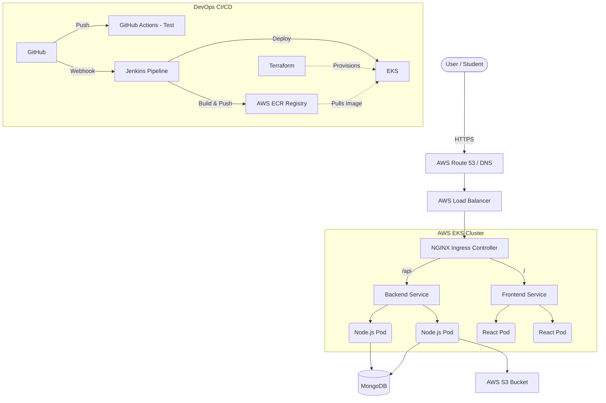
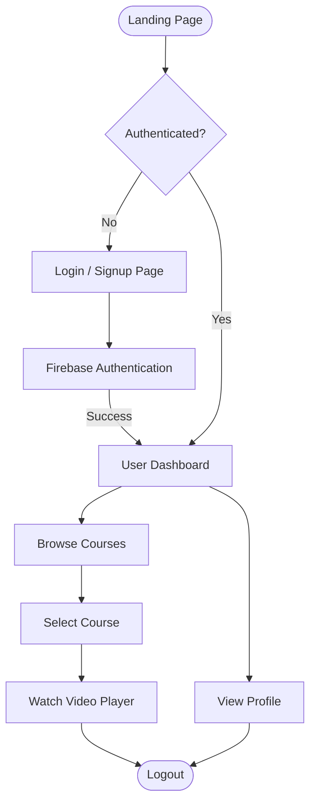
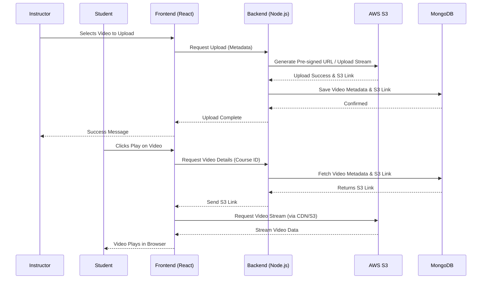
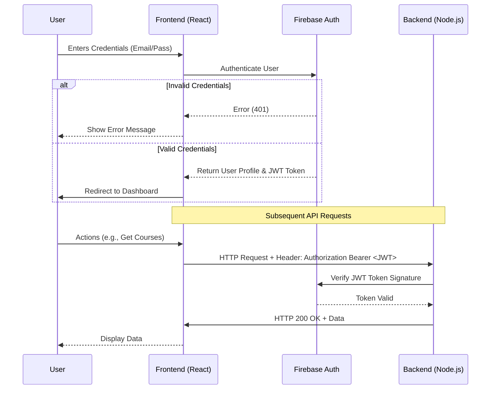

# Final Project Report

## 1. Student Details
**Name:** Sujal Warke  
**Course/Semester:** 4th Semester  
**Project Title:** DevOps-Driven Learning Management System (LMS)  
**Date of Submission:** [Insert Date]  

---

## 2. Problem Statement
**Problem Statement No:** [Insert Problem Statement Number]  
**Details:**  
Modern educational platforms require highly scalable, reliable, and easily maintainable infrastructures to handle variable student loads, video streaming, and secure content delivery. Traditional monolithic applications deployed manually on single servers suffer from poor scalability, frequent downtimes during updates, and lack of disaster recovery capabilities. The objective is to design and implement a Learning Management System utilizing a microservices architecture and modern DevOps practices (CI/CD, Containerization, Infrastructure as Code, and Orchestration) to solve these operational bottlenecks.

---

## 3. Solution
The proposed solution is a containerized, cloud-native Learning Management System deployed on AWS. 
- **Application Layer:** A decoupled architecture featuring a React/Vite frontend and a Node.js/Express backend.
- **Data & Storage:** MongoDB for structured data, AWS S3 for scalable video storage, and Firebase for secure authentication.
- **DevOps Lifecycle:** The entire infrastructure is provisioned dynamically using **Terraform** (Infrastructure as Code). The application is containerized using **Docker** and deployed onto an **AWS EKS** (Kubernetes) cluster to ensure high availability and auto-scaling.
- **CI/CD Pipeline:** A fully automated pipeline using **Jenkins** and **GitHub Actions** tests, builds, and deploys the application with zero downtime.
- **Monitoring:** System health is actively monitored using **Prometheus and Grafana**.

---

## 4. Technical Implementation & What It Does

### Technologies Used:
- **Frontend:** React, Vite (Provides a fast, responsive user interface for students and instructors).
- **Backend:** Node.js, Express (Handles API requests, database interactions, and business logic).
- **Authentication:** Firebase Auth (Manages secure user registration, login, and JWT generation).
- **Database:** MongoDB (Stores user profiles, course metadata, and video metadata).
- **Object Storage:** AWS S3 (Stores large multimedia files like course videos and thumbnails).
- **Containerization:** Docker (Packages the application and its dependencies into standardized units for development and production).
- **Orchestration:** Kubernetes / AWS EKS (Manages container deployment, scaling, and load balancing across multiple EC2 worker nodes).
- **Routing:** NGINX Ingress Controller (Acts as the API Gateway, routing external traffic to the correct internal Kubernetes services).
- **CI/CD:** Jenkins & GitHub Actions (Automates testing, Docker image creation, ECR pushing, and Kubernetes deployment).
- **Infrastructure as Code (IaC):** Terraform (Automates the creation of the EKS cluster, IAM roles, and networking infrastructure).

### What It Does:
The system allows instructors to upload educational videos securely to AWS S3, while students can log in via Firebase to browse and stream these courses. Behind the scenes, Kubernetes continuously monitors the traffic. If student traffic spikes during an exam period, the Horizontal Pod Autoscaler (HPA) automatically spins up more frontend/backend instances. When code is updated, the Jenkins pipeline ensures it is deployed seamlessly without dropping active student connections.

---

## 5. Architecture Diagrams

### 5.1 System Architecture Diagram
This diagram illustrates the overall infrastructure and deployment model of the LMS.

### 5.2 User Flow Diagram
This flow shows how a typical user navigates through the LMS application.

### 5.3 Video Upload & Watch Architecture Diagram
This diagram details the interaction between services when a video is uploaded or streamed.

### 5.4 Authentication Architecture Diagram
This illustrates the JWT-based authentication flow utilizing Firebase.

---

## 6. Screenshots

*(Replace the placeholder text below with actual screenshots of your project)*

### 6.1 Application UI
- **[Placeholder]** Screenshot of the Login/Registration Page.
- **[Placeholder]** Screenshot of the Main Dashboard / Course Listing.
- **[Placeholder]** Screenshot of the Video Player interface.

### 6.2 DevOps & Infrastructure
- **[Placeholder]** Screenshot of a successful Jenkins Pipeline execution.
- **[Placeholder]** Screenshot of AWS EKS Cluster showing running nodes/pods.
- **[Placeholder]** Screenshot of Grafana Dashboard showing cluster metrics.
- **[Placeholder]** Screenshot of Terraform Apply success terminal output.

---
*End of Report*
