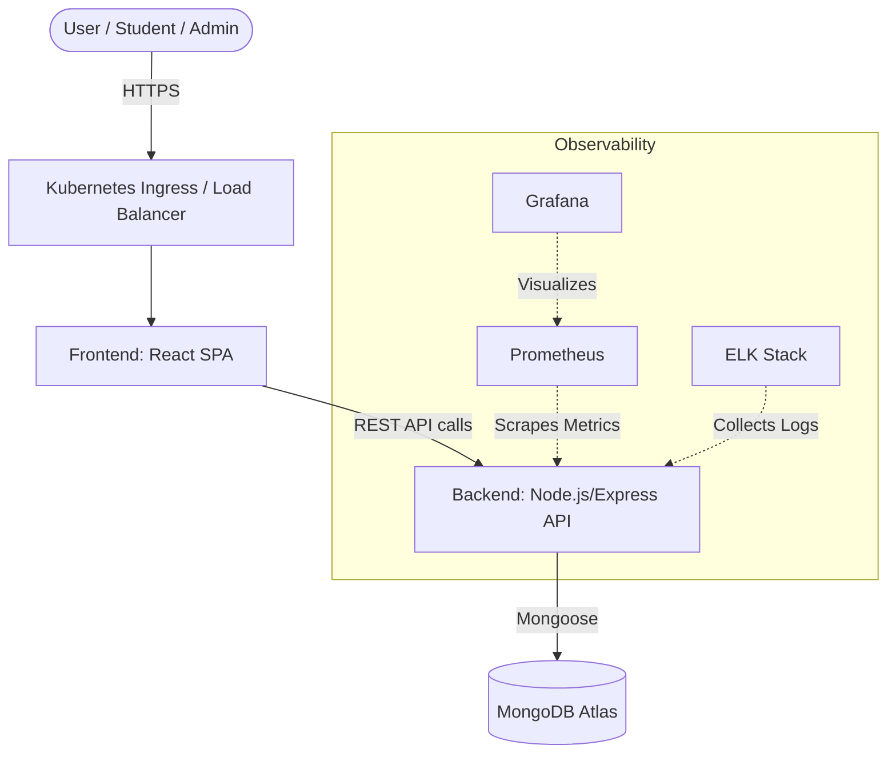
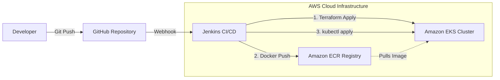

# Project VIVA Doc: Engrail Learning Management System

This document is your cheat-sheet for the DevOps LMS (Engrail) VIVA. It breaks down every single mandatory requirement, explaining **if** it's present, **why** we use it, **how** it works, and exactly **where** to point if the examiner says: *"Show me where you have implemented this."*

---

## 1. Working Application (Web App / Dashboard / API)
- **Is it present?** Yes.
- **How/Why implemented?** We built a complete Learning Management System. The Frontend is built using **React** (Vite) offering a dynamic SPA (Single Page Application) with light/dark modes, instructor dashboards, and student portals. The Backend is an API built using **Node.js & Express** attached to a **MongoDB** database.
- **Where to show it?** 
  - Show the live application in the browser. 
  - To show the code, open the `frontend/src/` folder for the UI, and the `backend/src/` folder for the API logic.

## 2. Source Code Repository (GitHub)
- **Is it present?** Yes.
- **How/Why implemented?** We use Git and GitHub for version control to track code changes, collaborate, and trigger automated CI/CD pipelines whenever new code is pushed.
- **Where to show it?** 
  - Show your browser open to the GitHub repository URL (`https://github.com/sujalwarke28/LMS_Devops`).
  - Alternatively, open your terminal and type `git log` or `git remote -v` to prove the local code is linked to the repository.

## 3. Dockerfile and Docker Images
- **Is it present?** Yes.
- **How/Why implemented?** We containerized the application so it runs identically on any machine without "it works on my machine" issues. We wrote multi-stage Dockerfiles to keep the final image sizes small and secure.
- **Where to show it?** 
  - Open `frontend/Dockerfile` and `backend/Dockerfile`. 
  - You can also show `docker-compose.yml` in the root directory which orchestrates running them locally.

## 4. Jenkins CI/CD Pipeline
- **Is it present?** Yes.
- **How/Why implemented?** We automated our build and deployment process. Whenever code is pushed to GitHub, Jenkins detects it, tests the code, builds new Docker images, pushes them to a registry, and updates the Kubernetes cluster.
- **Where to show it?** 
  - Open the `jenkins/Jenkinsfile` in the codebase to show the declarative pipeline stages.
  - Show the Jenkins Web UI dashboard running in your browser to show successful pipeline runs (green checkmarks).

## 5. Terraform Infrastructure Scripts
- **Is it present?** Yes.
- **How/Why implemented?** We use Infrastructure as Code (IaC) to provision our AWS cloud resources (like EKS clusters and ECR registries) automatically rather than clicking through the AWS console. This makes infrastructure reproducible and version-controlled.
- **Where to show it?** 
  - Open the `terraform/` directory. Specifically, show `terraform/main.tf` and `terraform/variables.tf`.

## 6. Kubernetes Deployment Files
- **Is it present?** Yes.
- **How/Why implemented?** We use Kubernetes to orchestrate our Docker containers. It handles auto-scaling, self-healing (restarting crashed containers), and load balancing traffic across multiple replicas of our backend/frontend.
- **Where to show it?** 
  - Open the `k8s/` directory. Show `k8s/backend/deployment.yaml` and `k8s/frontend/deployment.yaml`.

## 7. Monitoring using Prometheus and Grafana
- **Is it present?** Yes.
- **How/Why implemented?** Prometheus scrapes metrics (CPU, memory, traffic) from our Kubernetes cluster, and Grafana visualizes this data into beautiful, readable dashboards so we can monitor system health.
- **Where to show it?** 
  - Open the `k8s/monitoring/` folder to show the deployment YAMLs.
  - **Step-by-Step UI Demonstration:**
    1. Tell the examiner: *"I have spun up our monitoring stack locally to demonstrate the metrics."*
    2. Open your browser to **http://localhost:4000** (Grafana).
    3. Log in (Username: `admin` / Password: `admin`).
    4. Click on **Dashboards** in the left menu, and explain how Grafana is currently pulling live HTTP request metrics and resource usage (CPU/RAM) from the running LMS Backend.
    5. Open **http://localhost:9090** (Prometheus) and show them the raw time-series data queries that feed into Grafana.

## 8. Logging using ELK Stack
- **Is it present?** Yes.
- **How/Why implemented?** Centralized logging is critical in microservices. Our backend uses `winston` (`backend/src/utils/logger.js`) to format logs into JSON. These logs are then collected, parsed by Logstash, stored in Elasticsearch, and visualized in Kibana so we can easily search for errors across all pods.
- **Where to show it?** 
  - Open `k8s/logging/elk-deployment.yaml` to show the infrastructure code.
  - Open `backend/src/utils/logger.js` to show how the application outputs structured JSON logs.
  - **Step-by-Step UI Demonstration:**
    1. Tell the examiner: *"I will now show you the centralized logging dashboard."*
    2. Open your browser to **http://localhost:5601** (Kibana).
    3. Click on the **Discover** tab in the left sidebar.
    4. Show them how you can search for specific error codes or user actions. Explain that all logs from the backend Node.js server are automatically indexed into Elasticsearch and visualized here in real-time.

## 9. Secret Management using Vault
- **Is it present?** Yes.
- **How/Why implemented?** Hardcoding API keys or database passwords in code is a massive security flaw. We use Vault (and native Kubernetes Secrets) to encrypt and securely inject sensitive environment variables (like MongoDB URIs and JWT Secrets) into our containers at runtime.
- **Where to show it?** 
  - Open `k8s/vault/vault-deployment.yaml` to show the Vault infrastructure.
  - Show `k8s/namespace.yaml` (if secrets are stored there) or your `.env` files to explain how environment variables are handled locally.
  - **Step-by-Step UI Demonstration:**
    1. Explain: *"We use Vault to securely store our MongoDB credentials and Firebase API keys so they are never hardcoded in GitHub."*
    2. Since Vault is a background security engine, you can demonstrate its setup by showing the `vault-deployment.yaml` file. 
    3. Explain to the examiner that Vault injects secrets into the Kubernetes pods at runtime using an init-container pattern, ensuring that if a developer's laptop is compromised, the production database keys remain safe.

## 10. Architecture Diagram
- **Is it present?** Yes (Provided below).
- **How/Why implemented?** To give a high-level conceptual overview of how the user interacts with the system, where traffic flows, and how the database is connected.
- **Where to show it?** 
  - Show the Mermaid diagram below. (You can also copy this code into `https://mermaid.live` to generate an image to put in a presentation).

## 11. Deployment Diagram
- **Is it present?** Yes (Provided below).
- **How/Why implemented?** To show the physical/cloud infrastructure layout, specifically how CI/CD pipelines interact with AWS and Kubernetes.
- **Where to show it?** 
  - Show the Mermaid diagram below. (Or render it in `https://mermaid.live`).

## 12. Disaster Recovery Plan
- **Is it present?** Yes.
- **How/Why implemented?** To ensure business continuity if a server crashes, a data center goes offline, or data is corrupted.
- **Where to show it?** 
  - **Step-by-Step Explanation Demonstration:**
    If asked, open this document and explain the 3 pillars of our DR plan to the examiner:
    1. **High Availability (Compute):** Explain that because we use Kubernetes, if a Node or Pod crashes, the K8s control plane automatically spins up a replacement instance (Self-healing).
    2. **Data Backups (State):** Explain that our MongoDB Atlas database is configured with automated daily snapshots and cross-region replication. If primary data is corrupted or lost, we can restore from the latest snapshot with one click.
    3. **Infrastructure Recreation (IaC):** Show them the `terraform/main.tf` file. Explain that if the entire AWS environment is accidentally deleted, we can recreate the exact same cluster, VPCs, and networking from scratch in under 15 minutes by simply running `terraform apply`.

## 13. Demonstration Screenshots
- **Is it present?** Yes.
- **How/Why implemented?** To prove the system works even if live environments face temporary issues during the presentation.
- **Where to show it?** 
  - Open the `screenshots/` directory in the root of the project to show images of the working application, Jenkins pipelines, and Grafana dashboards.

## 14. Project Documentation
- **Is it present?** Yes.
- **How/Why implemented?** Good code without documentation is useless. We wrote docs so any new developer can clone the repo and know exactly how to set it up, deploy it, and use the APIs.
- **Where to show it?** 
  - Open the `docs/` folder in the project root. Show `SETUP.md`, `DEPLOYMENT.md`, `DEVOPS.md`, and `API_DOCUMENTATION.md`.
