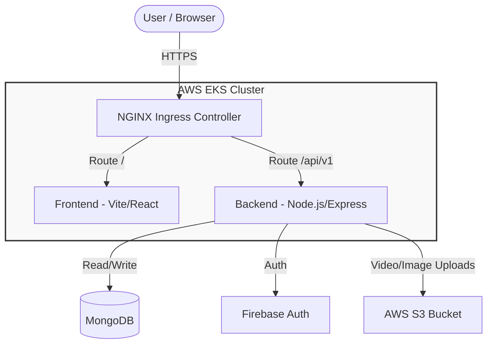
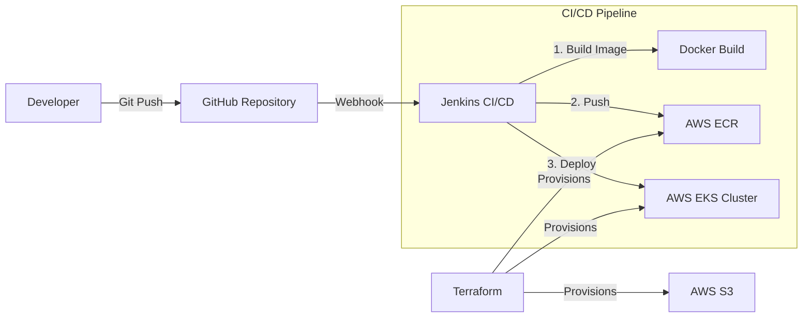
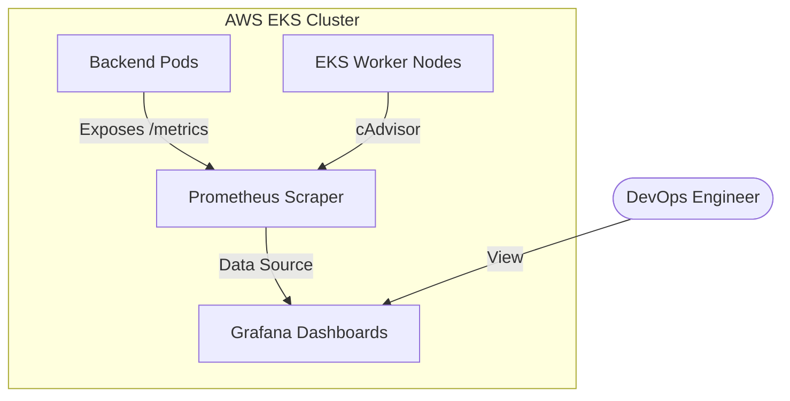
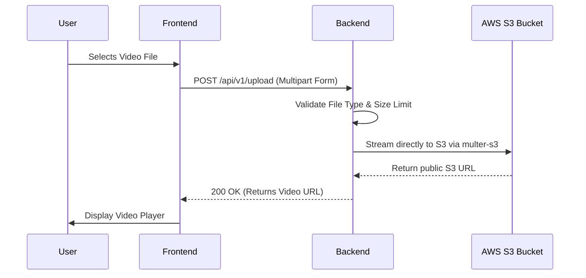

# Enterprise LMS Project Architecture

This document provides a comprehensive overview of the Enterprise Learning Management System (LMS) architecture. The project leverages a modern microservices-oriented approach, utilizing cloud-native DevOps practices for scalability, reliability, and security.

## 1. High-Level System Architecture

The core system consists of a Frontend application communicating with a Node.js Backend API. The backend interfaces with multiple managed services for data persistence, authentication, and object storage.

### Key Components:
* **Frontend (Vite):** Delivers the User Interface. Runs in an NGINX container to serve static assets efficiently.
* **Backend (Node.js/Express):** Handles core business logic, course management, enrollments, quizzes, and video processing.
* **NGINX Ingress:** Acts as the API Gateway. Routes incoming internet traffic to the correct internal Kubernetes services based on the URL path.
* **MongoDB:** The primary NoSQL database used for fast, flexible, structured data storage (Users, Courses, Progress).
* **Firebase:** Manages user authentication and issues secure JWT tokens.
* **AWS S3:** Scalable object storage used specifically for storing heavy course materials and streaming video uploads.

---

## 2. Infrastructure & CI/CD Architecture

The application is deployed on Amazon Web Services (AWS) using Elastic Kubernetes Service (EKS). The entire infrastructure is provisioned dynamically as code.

### Key Components:
* **Terraform:** Infrastructure-as-Code (IaC) tool that automates the creation of the VPC, Subnets, EKS Cluster, and ECR repositories without manual AWS console clicks.
* **AWS ECR:** A private container registry storing the versioned Docker images for both the frontend and backend.
* **Jenkins:** The CI/CD pipeline server that listens to GitHub pushes, automatically builds the latest Docker images, and applies updated Kubernetes manifests (`deployment.yaml`) to the cluster.

---

## 3. Observability & Monitoring Architecture

To ensure high availability and prevent downtime, the cluster implements a robust monitoring stack capable of tracking application health, hardware performance metrics, and bottlenecks.

### Key Components:
* **Prometheus:** A time-series database that continuously scrapes the `/metrics` endpoint from the Node.js backend (using the `prom-client` library) and records Kubernetes node health.
* **Grafana:** Visualizes the raw Prometheus data, providing beautiful, real-time dashboards for Process CPU usage, Event Loop Lag, Memory Consumption, and Active Handlers.

---

## 4. Video Upload & Data Flow Architecture

A critical component of the LMS is the ability to upload and stream large video files securely.

